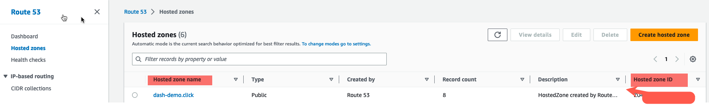
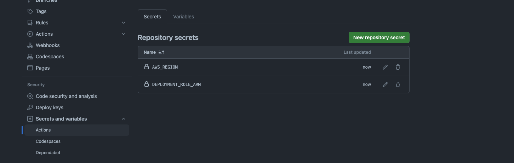

## Overview

This directory includes the 3 Github actions jobs that can be used to deploy the required infrastructure to host the React SPA application in AWS. The jobs must be run in order for they will require resource Ids to be updated before running them.

### [deploy-certificate.yml](1.deploy-certificate.yml)

The Github Action job allows you to either Plan, Deploy or Destroy the Terraform template. You must also setup the region where you want it to be deployed in [dev.tfvars](https://github.com/cristianstoichin/react-ci-cd-terraform/blob/main/infrastructure/terraform/1.cert/variables/dev.tfvars#L1). In this case, because we want to use the Certificate with a Cloudfront distribution, `the certificate MUST be deployed to us-east-1` (global). 

This Github Action is designed to create a new SSL certificate in AWS Certificate Manager, which will enable SSL connectivity for our website. Remember --> `us-east-1` 

Before running the Job (manual trigger), you must first have the following Github Repo Secrets setup:

1. `DEPLOYMENT_ROLE_ARN`
   - This must be an existing Role in your AWS account that will allow the job to run the `aws cloudformation deploy` command.
      - Typically, this role is granted Admin permissions in AWS. However, be aware that this could pose a security risk. AWS recommends using the least privileged permissions for enhanced security.
2. `HostedZoneId` and `HostedZoneName`
   - This is a pre-requisite before running the deployment. You must have a Route53 hosted zone (public) that will be used to validate the ssl certificate.
3. `SubDomainName' this can also be a secret but in this example I simply hardcoded the value. This must be your desired subdomain name for the website. Ex: react-demo.  

### [deploy-spa-infra.yml](2.deploy-spa-infra.yml)

The Github Action job allows you to either Validate, Deploy or Destroy the cloudformation template. You must also select a region where you want it to be deployed. 

This Github Action is designed to create the resources defined [here](https://github.com/cristianstoichin/react_ci_cd_clouformation/blob/main/infra/readme.md#spayml)

Before running the Job (manual trigger), you must first have the following Github Repo Secrets setup:

1. `AcmCertificateArn`
   - This is the ARN (Amazon Resource Name) of the SSL certificate that should have been generated following the execution of the previous GitHub Actions job.
2. `DEPLOYMENT_ROLE_ARN`
   - This must be an existing Role in your AWS account that will allow the job to run the `aws cloudformation deploy` command.
      - Typically, this role is granted Admin permissions in AWS. However, be aware that this could pose a security risk. AWS recommends using the least privileged permissions for enhanced security.
3. `HostedZoneId` and `HostedZoneName`
   - This is a pre-requisite before running the deployment. You must have a Route53 hosted zone (public) that will be used to validate the ssl certificate.
4. `SubDomainName' this can also be a secret but in this example I simply hardcoded the value. This must be your desired subdomain name for the website. Ex: react-demo.  

### [build-deploy-spa-app.yml](3.build-deploy-spa-app.yml)

The Github Action job allows you to manually `Deploy` a new version of the SPA react application by `branch`.

Before running the Job (manual trigger), you must first have the following Github Repo Secrets setup:

1. `DEPLOYMENT_ROLE_ARN`
   - This must be an existing Role in your AWS account that will allow the job to run the `aws cloudformation deploy` command.
      - Typically, this role is granted Admin permissions in AWS. However, be aware that this could pose a security risk. AWS recommends using the least privileged permissions for enhanced security.
2. `S3_BUCKET`
   - This is in the following format: `s3://{bucket-name}}`. In my case is s3://react-demo.dash-demo.click
3. `CDN_ID`
   - This is the AWS Cloudfront Distribution ID that you can retrieve after the `deploy-spa-infra.yml` completes successfully.

#### AWS Route53 Example

  

#### Github Secrets Example

  

