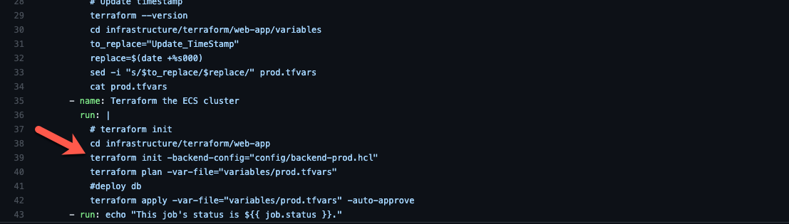

The Terraform State configuration file for the various environments.

It has the following values:

- `bucket = "backend-terraform-state-{Environment}"`
- `key = "github-actions-role/{Environment}/terraform.tfstate"`
- `encrypt  = true`

The `bucket` and `key` values specify the bucket name and subfolder in which the terraform state files get stored.

It is used on the terraform init step in the Github Action

- [Prod Deployment](TDB)
- [Non-Prod Deployment](TBD)

  

